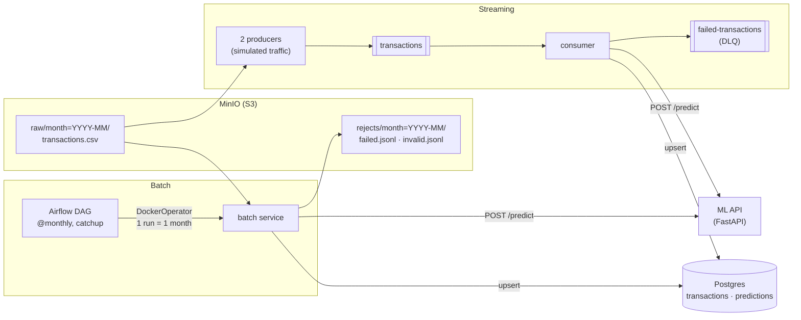

# transaction-enrichment-pipeline

Two pipelines that enrich bank transactions with a category from an ML service and store them in
Postgres. One is **batch** (Airflow, monthly partitions from object storage), the other **streaming**
(Kafka). Both run the same core logic, and both are safe to re-run: every write is idempotent,
so retries and redeliveries never create duplicates.

The ML service is a stub (`category = CATEGORIES[hash(id) % len(CATEGORIES)]`). This project is
about the pipelines around a model, not the model itself.

## Architecture



Batch and streaming share one library (`pipeline/library`): validation, orchestration (parallel API
calls, bulk writes) and the database layer. Each pipeline only implements how it **reads** its source.

## Design decisions

**Idempotent writes.** Transaction ids are deterministic: a UUID is kept, and any other source id is
mapped to a UUID5, so the same row always gets the same id. Transactions are inserted with
`ON CONFLICT DO NOTHING` and predictions are upserted. Re-running a month, retrying a task or
redelivering a Kafka message never duplicates a row.

**At-least-once streaming, with no data loss.** Kafka auto-commit is off. Each window is processed in
this order: write to Postgres in one transaction → publish failures to the DLQ and wait for delivery →
commit the offsets. If the consumer dies at any step, the window is redelivered, and the idempotent
writes absorb it. These guarantees are unit-tested (`pipeline/application/streaming/consumer/tests`).

**Batch runs own a partition.** The data is split by month (`raw/month=YYYY-MM/`). The DAG uses monthly
data intervals with catchup, so enabling it backfills 2023-01 → 2024-04, one run per month, each
processing only its own partition. Clearing a month in Airflow reprocesses exactly that month.

**Failures are kept, not just logged.**
| Failure | Streaming | Batch |
|---------|-----------|-------|
| Invalid record (schema, JSON) | DLQ, `error_type=invalid` | `rejects/month=…/invalid.jsonl`; the run succeeds, since retrying can't fix bad data |
| ML API still failing after retries (exponential backoff) | DLQ, `error_type=prediction_failed` | `rejects/month=…/failed.jsonl`; the run exits 1 so Airflow retries it |
| Database error | Rollback, consumer restarts, window redelivered | Rollback, Airflow retries the run |

**Lineage.** Each row stores `processing_type` (batch/streaming) and `run_id` (the Airflow run or the
producer), and each prediction stores the `model_version` returned by the API.

More detail, including trade-offs and the target architecture, is in [NOTES.md](NOTES.md).

## Quick start

Requires Docker (with Compose) and make.

```bash
make all      # creates .env from .env.example, builds and starts everything
make status   # container status
make down     # stop (make clean also removes volumes)
```

- **Streaming** starts right away: the producers publish continuously and the consumer writes to Postgres.
- **Batch**: the DAG is enabled at start and backfills the 16 months one by one. Follow it in Airflow.

| Service | URL | Credentials |
|---------|-----|-------------|
| Airflow | http://localhost:8082 | `admin` / `airflow123` |
| Kafka UI (topics, DLQ, consumer lag) | http://localhost:8081 | |
| Adminer (Postgres) | http://localhost:8080 | server `postgres`, `pipeline` / `pipeline_password`, db `transactions` |
| MinIO console | http://localhost:9001 | `minioadmin` / `minioadmin` |
| ML API docs | http://localhost:8000/docs | |

These are local development credentials. [HOWTO.md](HOWTO.md) is the full operating guide
(running each pipeline separately, logs, troubleshooting).

## Repository layout

| Path | Content |
|------|---------|
| `pipeline/library/` | Shared library: `core` (models, validation, orchestration) and `infrastructure` (ML API client, Postgres, file loading) |
| `pipeline/application/batch/service/` | Batch job: reads one partition, writes results and rejects |
| `pipeline/application/batch/orchestration/` | Airflow DAG running the batch job with the DockerOperator |
| `pipeline/application/streaming/producer/` | Simulated transaction traffic |
| `pipeline/application/streaming/consumer/` | Kafka consumer: DB write → DLQ → offset commit |
| `ml_api/` | Stub prediction service (FastAPI) |
| `migrations/` | Postgres schema (Flyway) |
| `data/transactions/` | Source data, 10,000 transactions in monthly partitions |

Each component has its own README. Every Python component is a uv workspace member with its own
lockfile and Docker image.

## Development

```bash
cd pipeline/library && uv run pytest                          # library tests
cd pipeline/application/streaming/consumer && uv run pytest   # delivery-guarantee tests
uv run pre-commit run --all-files                             # ruff, pyright, pydocstyle, tests
```

## Roadmap

- CI (GitHub Actions): lint and tests, plus a `docker compose` smoke test
- Observability: Prometheus metrics (throughput, failures, API latency, consumer lag), OpenTelemetry
  traces carried through Kafka headers, a provisioned Grafana dashboard and alerts

## Context

This started as a take-home data-engineering exercise: build a batch and a real-time pipeline that
categorize transactions through a provided ML API, with the prediction logic kept as given. It has
since been reworked as a portfolio project.
